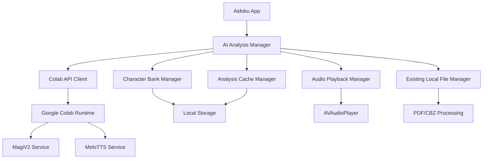

# Design Document

## Overview

The AI Manga Analysis feature integrates Google Colab-hosted MagiV2 and MeloTTS services into the Aidoku app to provide character recognition, OCR, and text-to-speech capabilities for manga content. The system extends the existing local file management infrastructure to support AI-powered analysis while maintaining offline access to processed results.

The architecture follows a client-server model where the iOS app acts as a client to the Google Colab runtime, sending manga pages for analysis and receiving structured JSON responses containing character identification, dialogue extraction, and audio generation capabilities.

## Architecture

### High-Level Components



### Service Integration Points

The feature integrates with existing Aidoku components:
- **LocalFileManager**: Extended to automatically trigger AI analysis when PDFs are imported
- **CoreDataManager**: Enhanced to store analysis results and character banks
- **URLSession**: Used for API communication with Colab endpoint and ElevenLabs
- **Reader UI**: Enhanced to display analysis overlays and audio controls

### Automatic Analysis Workflow

1. **PDF Import Detection**: When a PDF manga is imported via LocalFileManager
2. **Page Extraction**: PDF pages are automatically extracted as PNG images
3. **Base64 Encoding**: Images are converted to base64 for API transmission
4. **Batch Upload**: Pages are sent to Colab endpoint in batches to avoid memory issues
5. **Background Processing**: Analysis runs in background while user can continue using app
6. **Result Caching**: Analysis results are automatically cached locally
7. **Audio Generation**: Dialogue is automatically sent to ElevenLabs for voice synthesis

## Components and Interfaces

### 1. AI Analysis Manager

**Purpose**: Central coordinator for all AI analysis operations

```swift
actor AIAnalysisManager {
    static let shared = AIAnalysisManager()
    
    func analyzeChapter(mangaId: String, chapterId: String) async throws -> AnalysisResult
    func getAnalysisResult(mangaId: String, chapterId: String) async -> AnalysisResult?
    func updateCharacterBank(mangaId: String, characters: [CharacterInfo]) async
    func generateAudio(transcript: [DialogueLine]) async throws -> [AudioSegment]
}
```

**Key Responsibilities**:
- Orchestrate the analysis workflow
- Manage character banks per manga series
- Cache analysis results locally
- Coordinate with audio generation services

### 2. Colab API Client

**Purpose**: Handle communication with Google Colab runtime

```swift
class ColabAPIClient {
    private let baseURL: URL
    private let apiKey: String?
    
    func uploadPages(_ pages: [UIImage]) async throws -> String // Returns job ID
    func getAnalysisResult(jobId: String) async throws -> ColabAnalysisResponse
    func generateAudio(transcript: [DialogueLine], voiceSettings: VoiceSettings) async throws -> [AudioData]
    func healthCheck() async throws -> Bool
}
```

**API Endpoints**:
- `POST /analyze` - Upload pages and character bank for analysis
- `GET /status/{jobId}` - Check analysis progress
- `GET /result/{jobId}` - Retrieve analysis results
- `POST /audio` - Generate audio from transcript
- `GET /health` - Service health check

### 3. Character Bank Manager

**Purpose**: Manage character reference images and names per manga series

```swift
class CharacterBankManager {
    func getCharacterBank(mangaId: String) async -> CharacterBank?
    func addCharacter(mangaId: String, name: String, referenceImages: [UIImage]) async
    func updateCharacter(mangaId: String, characterId: String, name: String?, images: [UIImage]?) async
    func removeCharacter(mangaId: String, characterId: String) async
    func exportCharacterBank(mangaId: String) async -> Data?
    func importCharacterBank(mangaId: String, data: Data) async throws
}
```

### 4. Analysis Cache Manager

**Purpose**: Local storage and retrieval of analysis results

```swift
class AnalysisCacheManager {
    func cacheAnalysisResult(_ result: AnalysisResult, mangaId: String, chapterId: String) async
    func getCachedResult(mangaId: String, chapterId: String) async -> AnalysisResult?
    func clearCache(mangaId: String) async
    func getCacheSize() async -> Int64
    func cleanupOldCache(olderThan: TimeInterval) async
}
```

### 5. Audio Playback Manager

**Purpose**: Handle audio playback with synchronized text highlighting

```swift
class AudioPlaybackManager: ObservableObject {
    @Published var isPlaying: Bool = false
    @Published var currentSegment: Int = 0
    @Published var playbackProgress: Double = 0.0
    
    func playTranscript(_ segments: [AudioSegment]) async
    func pause()
    func resume()
    func seek(to segment: Int)
    func setPlaybackRate(_ rate: Float)
}
```

### 6. PDF Page Extractor

**Purpose**: Extract individual pages from PDF files as images for analysis

```swift
class PDFPageExtractor {
    func extractPages(from pdfURL: URL) async throws -> [UIImage]
    func extractPageAsBase64(from pdfURL: URL, pageIndex: Int) async throws -> String
    func extractAllPagesAsBase64(from pdfURL: URL, maxSize: CGSize) async throws -> [String]
}
```

## Data Models

### Core Analysis Models

```swift
struct AnalysisResult: Codable {
    let mangaId: String
    let chapterId: String
    let pages: [PageAnalysis]
    let transcript: [DialogueLine]
    let audioSegments: [AudioSegment]?
    let analysisDate: Date
    let version: String
}

struct PageAnalysis: Codable {
    let pageIndex: Int
    let textRegions: [TextRegion]
    let characterDetections: [CharacterDetection]
    let textCharacterAssociations: [Int: Int] // text_idx: char_idx
}

struct TextRegion: Codable {
    let id: Int
    let text: String
    let boundingBox: CGRect
    let confidence: Float
    let isEssential: Bool
}

struct CharacterDetection: Codable {
    let id: Int
    let name: String
    let boundingBox: CGRect
    let confidence: Float
}

struct DialogueLine: Codable {
    let pageIndex: Int
    let textId: Int
    let speaker: String
    let text: String
    let timestamp: TimeInterval?
}

struct AudioSegment: Codable {
    let dialogueId: String
    let audioData: Data
    let duration: TimeInterval
    let speaker: String
}
```

### Character Bank Models

```swift
struct CharacterBank: Codable {
    let mangaId: String
    let characters: [CharacterInfo]
    let lastUpdated: Date
}

struct CharacterInfo: Codable {
    let id: String
    let name: String
    let referenceImages: [String] // File paths
    let confidence: Float
    let lastSeen: Date
}
```

### Configuration Models

```swift
struct ColabConfiguration: Codable {
    let endpointURL: URL
    let apiKey: String?
    let timeout: TimeInterval
    let maxRetries: Int
    let batchSize: Int
}

struct VoiceSettings: Codable {
    let defaultSpeaker: String // XTTS-v2 speaker name
    let characterSpeakers: [String: String] // character_name: speaker_name
    let language: String // Language code (en, es, fr, etc.)
}

struct XTTSConfiguration: Codable {
    let voiceSettings: VoiceSettings
    let availableSpeakers: [String]
    let supportedLanguages: [String]
}
```

## Error Handling

### Error Types

```swift
enum AIAnalysisError: LocalizedError {
    case networkUnavailable
    case endpointNotConfigured
    case invalidResponse
    case analysisTimeout
    case insufficientStorage
    case characterBankCorrupted
    case audioGenerationFailed
    case unsupportedFileFormat
    
    var errorDescription: String? {
        switch self {
        case .networkUnavailable:
            return "Network connection unavailable"
        case .endpointNotConfigured:
            return "Google Colab endpoint not configured"
        case .invalidResponse:
            return "Invalid response from analysis service"
        case .analysisTimeout:
            return "Analysis request timed out"
        case .insufficientStorage:
            return "Insufficient storage for analysis cache"
        case .characterBankCorrupted:
            return "Character bank data is corrupted"
        case .audioGenerationFailed:
            return "Failed to generate audio"
        case .unsupportedFileFormat:
            return "Unsupported file format for analysis"
        }
    }
}
```

### Error Recovery Strategies

1. **Network Failures**: Implement exponential backoff with jitter
2. **Service Unavailable**: Queue requests for retry when service returns
3. **Partial Failures**: Save partial results and allow manual retry
4. **Storage Issues**: Implement cache cleanup and user notification
5. **Corrupted Data**: Provide data repair and re-analysis options

## Testing Strategy

### Unit Testing

1. **API Client Tests**
   - Mock Colab endpoint responses
   - Test error handling and retry logic
   - Validate request/response serialization

2. **Character Bank Tests**
   - Test CRUD operations
   - Validate data persistence
   - Test import/export functionality

3. **Cache Manager Tests**
   - Test cache storage and retrieval
   - Validate cache cleanup logic
   - Test concurrent access scenarios

4. **Audio Playback Tests**
   - Test playback synchronization
   - Validate audio segment management
   - Test playback controls

### Integration Testing

1. **End-to-End Analysis Flow**
   - Test complete analysis pipeline
   - Validate data flow between components
   - Test error propagation

2. **UI Integration Tests**
   - Test analysis result display
   - Validate audio playback controls
   - Test character bank management UI

3. **Performance Tests**
   - Test large manga analysis
   - Validate memory usage during processing
   - Test concurrent analysis requests

### Manual Testing Scenarios

1. **Network Conditions**
   - Test with poor connectivity
   - Test offline behavior
   - Test endpoint switching

2. **Content Variety**
   - Test different manga styles
   - Test various languages
   - Test different page layouts

3. **User Workflows**
   - Test character bank building
   - Test analysis result review
   - Test audio playback experience

## Security Considerations

### Data Privacy
- Character bank data remains local to device
- Analysis results cached locally with encryption
- Optional data anonymization before sending to Colab

### API Security
- Support for API key authentication
- Request signing for sensitive operations
- Rate limiting to prevent abuse

### Content Protection
- Respect manga copyright in analysis exports
- Watermark generated audio content
- Limit sharing capabilities for copyrighted content

## Performance Optimization

### Image Processing
- Compress images before upload while maintaining quality
- Batch multiple pages in single requests
- Implement progressive analysis for large chapters

### Caching Strategy
- LRU cache for analysis results
- Lazy loading of audio segments
- Background cache cleanup

### Memory Management
- Stream large audio files instead of loading entirely
- Release image data after processing
- Implement memory pressure handling

## Accessibility

### Audio Features
- VoiceOver integration for analysis results
- Customizable audio playback controls
- Support for hearing-impaired users with visual cues

### Visual Features
- High contrast mode for analysis overlays
- Adjustable text size for dialogue display
- Color-blind friendly character identification

## Localization

### Multi-language Support
- OCR results in original manga language
- UI text localized to user's language
- Character name handling for different scripts

### Audio Localization
- Support for multiple TTS languages
- Regional voice variations
- Pronunciation customization for character names