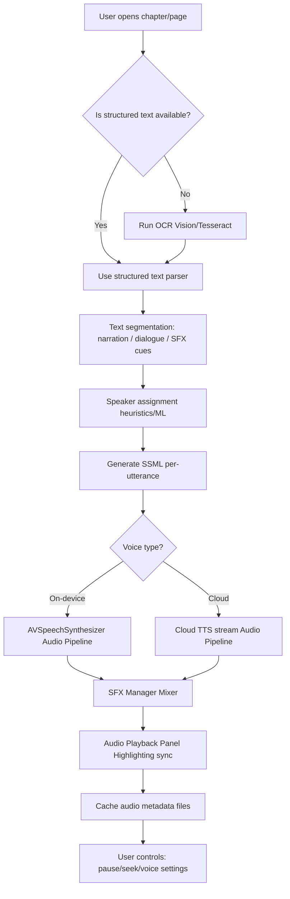
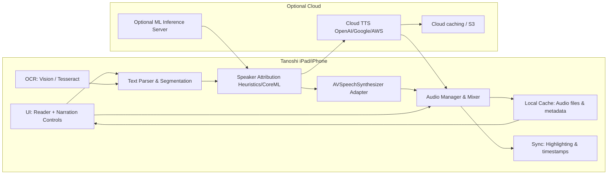

# Tanoshi
A revolutionary manga reading application with AI-powered narration for iOS and iPadOS.

## Features
- [x] No ads
- [x] Robust WASM source system
- [x] Online reading through external sources
- [x] Downloads
- [x] Tracker integration (AniList, MyAnimeList)
- [x] AI-powered manga narration with voice synthesis
- [x] Smart text recognition and speaker identification
- [x] Real-time audio synchronization with panel highlighting
- [x] Cloud and on-device TTS support

## AI Narration System

Tanoshi features an advanced AI narration system that transforms manga reading into an immersive audio-visual experience.

### Workflow: page → speech (high-level)

### System design component diagram

## Installation

For detailed installation instructions, check out the releases page.

### Manual Installation

The latest ipa file will always be available from the releases page.

## Contributing

Tanoshi is actively developed with cutting-edge AI features. This project is open source and welcomes contributions.

This repo is licensed under GPLv3. All code is original and written specifically for this project.

## License

This project is licensed under the GNU General Public License v3.0 - see the LICENSE file for details.
